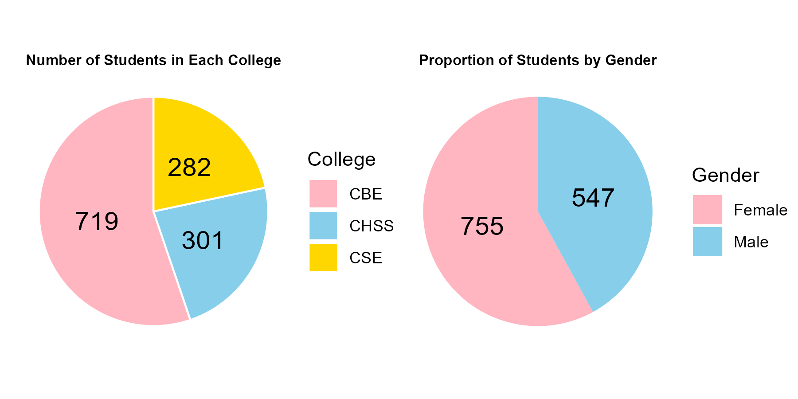
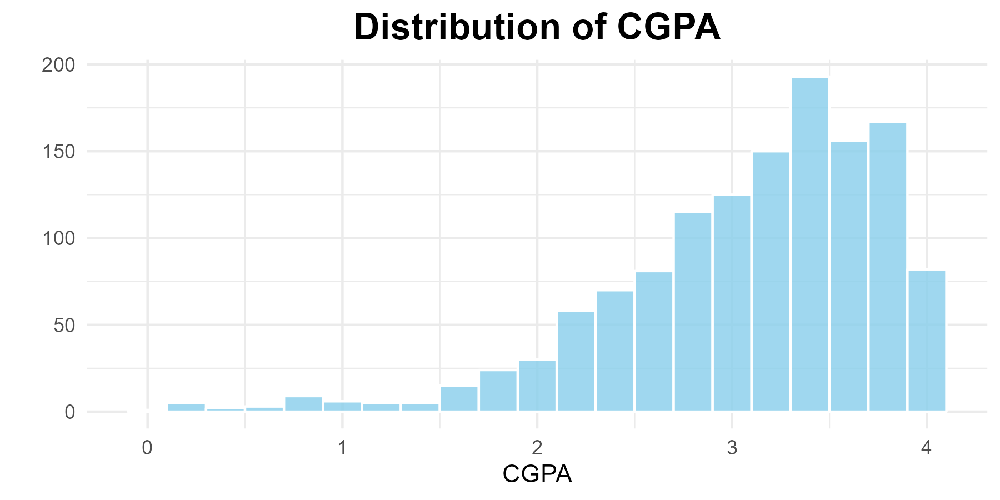
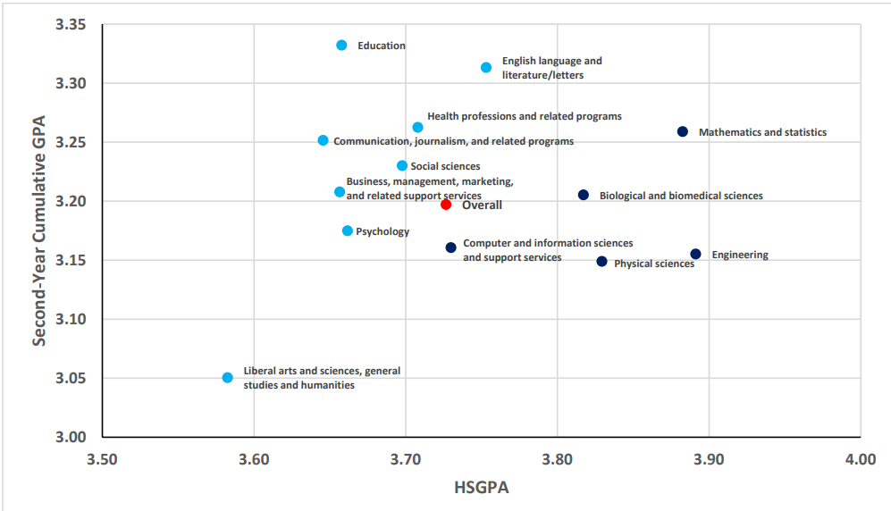

<style>
body {
  line-height: 2; /* Double spacing */
}
</style>

\doublespacing
```{r setup, include=FALSE}
knitr::opts_chunk$set(message = FALSE)
knitr::opts_chunk$set(include = TRUE)
knitr::opts_chunk$set(warning = FALSE)
knitr::opts_chunk$set(fig.width = 8,fig.height = 4)
knitr::opts_chunk$set(echo = TRUE)
```

```{r, include=FALSE, echo = FALSE} 
library(dplyr)
library(ggplot2)
library(tidyr)
library(ggpubr)
library(dplyr)
library(tidyr)
#install.packages("readxl")  # Install the package
library(readxl)  
library(gridExtra)
library(car)
library(patchwork)

```

\newpage
# Abstract

This report aims to analyze the American University of Armenia (AUA) student GPA statistics provided by AUA’s Office of Institutional Research and Assessment (OIRA). The study identifies patterns in academic performance across metrics such as colleges, majors, genders, financial aid satus, etc. This analysis highlights trends and potential factors that affect the final cumulative GPA of students.


# Data Collection

The data for this study was obtained from AUA's OIRA. Key variables included:

- **Student ID**: Numeric code assigned to students.
- **FirstEnrolled_MajorCode**: Initial major of enrollment.
- **College**: College associated with each major.
- **FincialAid_Received_AtLeast_Once**: Binary variable indicating whether financial aid was received.
- **FirstEnrolled_Year**: Year of initial enrollment.
- **Gender**: Gender information of students.
- **School_GPA**: Standardized GPA (0-5 scale).
- **RoA (Republic of Armenia)**: Binary variable indicating citizenship.
- **FirstYear_CGPA**: GPA for the first year.
- **All_CGPA**: Cumulative GPA.

Data privacy concerns led to the exclusion of rows with a count of five or fewer to ensure student anonymity.


# A Glance at the Data

```{r,echo=FALSE}
gpa_data <- read_excel("DS_student_request.xlsx")
gpa_data
```
\newpage


```{r,echo=FALSE}
gpa_data <- gpa_data %>%
  filter(!is.na(All_CGPA)) %>% filter(!is.na(FirstYear_CGPA))
```
```{r, echo = FALSE}

college_counts <- gpa_data %>%
  filter(!is.na(College)) %>%
  group_by(College) %>%
  summarise(student_count = n())
```


```{r, echo = FALSE, fig.cap = "Distribution of AUA Students by College and Gender", out.width="80%"}
college_plot <- ggplot(college_counts, aes(x = "", y = student_count, fill = College)) +
  geom_bar(stat = "identity", width = 1, color = "white") +
  coord_polar("y", start = 0) +
  geom_text(aes(label = student_count), position = position_stack(vjust = 0.5), size = 5) +
  theme_void() +
  labs(title = "Number of Students in Each College", fill = "College") +
  scale_fill_manual(values = c("#FFB6C1", "#87CEEB", "#FFD700")) +   
  theme(
    plot.title = element_text(hjust = 0.5, size = 8, face = "bold")
  ) 
gender_counts <- gpa_data %>%
  group_by(Gender) %>%
  summarise(count = n())
gender_plot <- ggplot(gender_counts, aes(x = "", y = count, fill = Gender)) +
  geom_bar(stat = "identity", width = 1) +
  coord_polar("y", start = 0) +
  theme_void() +
  scale_fill_manual(values = c("#FFB6C1", "#87CEEB")) +
  geom_text(aes(label = count), position = position_stack(vjust = 0.5), size = 5) +
  labs(title = "Proportion of Students by Gender")+   theme(
    plot.title = element_text(hjust = 0.5, size = 8, face = "bold")
  ) 

# Arrange the plots side by side
combined_plot <- college_plot + gender_plot
ggsave("combined_plot.png", combined_plot, width = 6, height = 3)

# Display the image

```

The piecharts show the distribution of students by 1) College and 2) Gender.

As it can be seen from Fig. 1, the College of CSE has the most number of enrolled students, CHSS and CSE are relatively closer to each other in numbers and more than twice as less than CBE. Looking at the distribution by gender, it is seen that the number of female students exceeds the number of male students by ~200. 

```{r, echo=FALSE, fig.cap = "Histogram of CGPA", out.width="80%"}
dist = ggplot(data = gpa_data, aes(x = All_CGPA)) +
  geom_histogram(binwidth = 0.2, fill = "#87CEEB", color = "white", alpha = 0.8) +
  theme_minimal() +
  labs(title = "Distribution of CGPA", x = "CGPA", y = "") +
  theme(plot.title = element_text(hjust = 0.5, size = 16, face = "bold"))

ggsave("histogram.png", dist, width = 6, height = 3)

# Display the image

```

Now a glance at the distribution of All Cumulative GPA from Fig. 2. From the plot, it can be seen that the distribution is skewed and has a concentration around 3.3-3.7.

# Literature Review

To better understand the effects of some of our factors on students' performances, we conducted a Literature Review and studued some articles that tested some similr factors.

## Factors Influencing College Persistence for First-Time Students

The first article chosen to study the influce of the factors present in our dataset was  article"Factors Influencing College Persistence for First-Time Students" by Sheilynda Stewart, Doo Hun Lim, and JoHyun Kim. It  examines various factors that impact whether students persist in their college education (which, admittedly, is different from studying the influence of these factors on the students' GPA). Some of the key points we want to highlight are:

 - \textbf{Need-Based Grants:} The authors highlight the positive role of financial aid, particularly need-based grants (which is similar to the Financial Aid granted to the students by AUA), in supporting college persistence. These grants reduce financial stress and help students from lower socioeconomic backgrounds stay enrolled, demonstrating their significant influence on retention rates.

 - \textbf{Gender:} Findings on gender differences in persistence are mixed. Some studies cited in the article reveal that women persist and graduate at higher rates compared to men, while others show no significant gender differences in dropout behavior. The resulrs of the study itself did not indicate that gender is significant when it comes to college persistence. This indicates that gender may interact with other factors, such as major or institutional characteristics, to influence outcomes.

 - \textbf{School GPA:} According to this study, academic performance, as reflected in a student’s High School and First Year College GPA, is a strong predictor of persistence. Students with higher GPAs are more likely to stay enrolled and complete their degrees. A strong academic foundation during the first year appears critical in sustaining momentum toward graduation. However, it is import to take into consideration the fact that the high school GPAs of the students used in this study were self-reported, so the findings may have some inaccuracies.

## Collegeboard Analysis 

The second source chosen for understanding our factor is the was an analysis conducted by Collegeboard (the organization responsible for conducting the SAT tests) called "Using SAT Scores to Inform Academic Major-Related Decisions and Planning on Campus" by Paul A. Westrick, Jessica P. Marini, and Emily J. Shaw. While the overall goal of the study was not the analysis of college performance, it did include some interesting findings that may be useful to us in the future.

The most interesting finding for our study was the following plot:
```{r, echo = FALSE, fig.cap = 'Relationship Between High School and College GPA by Major',  out.width="95%"}

```
As can be seen in Fig. 3, the reason why we wanted to focus on this study is because it shows some interesting trends about how the major of the students can correlate with their High School and College GPA.
Some of the interesting points that can be derived from this plot are:
 - \textbf{Science Majors:} One of the more interesting things on this plot is the fact that while Science majors (Math, Engineering, etc) have the highest GPAs in their school years, their College GPAs seem to be somewhat lower than that of the other majors in college.
 - \textbf{Business Majors:} Another interesting statistic is that Business majors are around the middle in both high school and college GPA.
 - \textbf{Communications Majors:} The last finding that can be somewhat related to our data is the fact Communications majors (which can correspond to the students in AUA's English and Communications program), despite having a relatively lower High School GPA, have one of the highest GPAs in College.

However, it is important to note that the study was conducted on the data of US students and might not reflect some trends present in the Armenian education system.

## Ethnic and gender stereotypes on college students’ academic performance

The last article we will discuss is Ethnic and gender stereotypes on college students’ academic performance" by Ya-Wen (Melissa) Liang, Don Jones and Rebecca A. Robles-Pina.
The reason why this article can be somewhat relevant is because it was conducted at a small university in Texas. While this does not directly correlate to Armenia, it is still important to note that Texas, being one of the more conservative states in the U.S., can show somewhat similar soicietal factors to Armenia, a very conservative country.

The main finding of this study was that gender had a significant effect on the students'GPA, and female students had a higher GPA than males.

# Exploratory Data Analysis (EDA)

```{r,echo=FALSE, fig.cap = "Average CGPA by Cohort", out.width="90%"}
# Calculate average CGPA, standard deviation, and standard error for each enrollment year
gpa_trend <- gpa_data %>%
  group_by(FirstEnrolled_Year) %>%
  summarise(
    average_cgpa = mean(All_CGPA, na.rm = TRUE),
    sd_cgpa = sd(All_CGPA, na.rm = TRUE),
    n = sum(!is.na(All_CGPA))  # Count non-NA values
  ) %>%
  mutate(se_cgpa = sd_cgpa / sqrt(n))  # Calculate standard error

# Plot with error bars
ggplot(data = gpa_trend, aes(x = FirstEnrolled_Year, y = average_cgpa)) +
  geom_line(color = "#87CEEB", size = 1.2) +
  geom_errorbar(aes(ymin = average_cgpa - se_cgpa, ymax = average_cgpa + se_cgpa),
                width = 0.2, color = "darkblue", size = 0.8) +  # Add error bars
  theme_minimal() +
  labs(title = "Average CGPA Over Enrollment Years", 
       x = "Enrollment Year", 
       y = "Average CGPA") +
  theme(plot.title = element_text(hjust = 0.5, size = 13, face = "bold")) +
  ylim(0, 4)

```

Fig. 4 shows the average CGPA (with error bar by standard error) over the enrollment years. As it can be observed, there is almost no difference between the cohorts of different years and their average is slightly higher tha 3.0.

```{r, echo=FALSE, out.width="90%", fig.cap = 'GPA Distribution by Gender'}
# Data for All_CGPA
data_gpa_gender_all <- gpa_data %>%
  filter(!is.na(All_CGPA)) %>%
  group_by(Gender) %>%
  summarise(
    average_cgpa = mean(All_CGPA, na.rm = TRUE),
    student_count = n()
  )

# Data for FirstYear_CGPA
data_gpa_gender_first <- gpa_data %>%
  filter(!is.na(FirstYear_CGPA)) %>%
  group_by(Gender) %>%
  summarise(
    average_cgpa = mean(FirstYear_CGPA, na.rm = TRUE),
    student_count = n()
  )

# Plot for All_CGPA
plot_all <- ggplot(data = data_gpa_gender_all, aes(x = Gender, y = average_cgpa, fill = Gender, group = Gender)) +
  geom_bar(stat = "identity") +
  geom_text(aes(label = round(average_cgpa, 2)), vjust = 5, size = 5) +
  theme_minimal() +
  labs(title = "Average GPA by Gender (All_CGPA)", y = "Average CGPA", x = "") +
  theme(
    plot.title = element_text(hjust = 0.5, size = 10, face = "bold")
  ) +
  scale_fill_manual(values = c("#FFB6C1", "#87CEEB", "#FFD700", "#98FB98", "#FF69B4", "#FFA07A"))

# Plot for FirstYear_CGPA
plot_first <- ggplot(data = data_gpa_gender_first, aes(x = Gender, y = average_cgpa, fill = Gender, group = Gender)) +
  geom_bar(stat = "identity") +
  geom_text(aes(label = round(average_cgpa,2)), vjust = 5, size = 5) +
  theme_minimal() +
  labs(title = "Average GPA by Gender (FirstYear_CGPA)", y = "Average CGPA", x = "") +
  theme(
    plot.title = element_text(hjust = 0.5, size = 10, face = "bold")
  ) +
  scale_fill_manual(values = c("#FFB6C1", "#87CEEB", "#FFD700", "#98FB98", "#FF69B4", "#FFA07A"))

# Arrange the two plots side by side
grid.arrange(plot_all, plot_first, ncol = 2)

```
Fig. 5 compares the average CGPA of students by gender, displayed separately for two categories: All_CGPA and FirstYear_CGPA. Female students demonstrate higher average GPAs in both categories, with an average of 3.29 for All_CGPA and 3.15 for FirstYear_CGPA. In contrast, male students achieve averages of 2.81 for All_CGPA and 2.68 for FirstYear_CGPA. 

```{r, echo=FALSE, out.width="80%", fig.cap = 'GPA Distribution by Financial Aid Status'}
# Plot for All_CGPA
plot_all_cgpa <- ggplot(data = gpa_data, aes(x = as.factor(FincialAid_Received_AtLeast_Once), y = All_CGPA, fill = as.factor(FincialAid_Received_AtLeast_Once))) +
  geom_boxplot(alpha = 0.7) +
  theme_minimal() +
  labs(title = "Cumulative GPA by Financial Aid Status", x = "Financial Aid", y = "All CGPA") +
  scale_fill_manual(values = c("#E57373", "#81C784")) +  # Softer red and green
  scale_x_discrete(labels = c("No", "Yes")) +  # Rename 0 and 1 to No and Yes
  theme(
    legend.position = "none",
    plot.title = element_text(hjust = 0.5, size = 13, face = "bold")
  )

# Plot for FirstYear_CGPA
plot_first_year <- ggplot(data = gpa_data, aes(x = as.factor(FincialAid_Received_AtLeast_Once), y = FirstYear_CGPA, fill = as.factor(FincialAid_Received_AtLeast_Once))) +
  geom_boxplot(alpha = 0.7) +
  theme_minimal() +
  labs(title = "First Year GPA by Financial Aid Status", x = "Financial Aid", y = "First Year CGPA") +
  scale_fill_manual(values = c("#E57373", "#81C784")) +
  scale_x_discrete(labels = c("No", "Yes")) +
  theme(
    legend.position = "none",
    plot.title = element_text(hjust = 0.5, size = 13, face = "bold")
  )

# Arrange the plots side by side
grid.arrange(plot_all_cgpa, plot_first_year, ncol = 2)

```
This figure displays the distribution of 1st Year/All Cumulative GPAs based on whether students received financial aid. The boxplots of both categories indicates that the median GPA is slightly higher for students who received financial aid (green) compared to those who did not (red). The interquartile range (IQR) is similar for both groups, but there are more outliers in the group without financial aid, particularly on the lower end of the GPA scale. This suggests that financial aid may provide a stabilizing effect on academic performance, reducing extreme variations and potentially supporting better outcomes.

\newpage

```{r, echo=FALSE, out.width="90%", fig.cap = 'First Year GPA Distribution by RoA Citizenship'}
gpa_data_filtered <- gpa_data %>%
  filter(!is.na(FirstYear_CGPA), !is.na(RoA))

# Create the boxplot
ggplot(data = gpa_data_filtered, aes(x = as.factor(RoA), y = All_CGPA, fill = as.factor(RoA))) +
  geom_boxplot(alpha = 0.7) +
  theme_minimal() +
  labs(
    title = "1st Year CGPA by Citizenship Status (Republic of Armenia)", 
    x = "Citizenship Status", 
    y = "1st Year CGPA"
  ) +
  scale_fill_manual(values = c("#87CEEB", "#FFA07A")) +  # Custom colors
  scale_x_discrete(labels = c("No", "Yes")) +  # Rename 0 and 1 to No and Yes
  theme(legend.position = "none") +
  theme(
    legend.position = "none",
    plot.title = element_text(hjust = 0.5, size = 13, face = "bold")
  )


```

This figure shows boxplots comparing the All CGPA distribution of students categorized by citizenship status, where "Yes" indicates students with Armenian citizenship, and "No" represents non-Armenian citizens. Students with Armenian citizenship exhibit slightly higher median GPAs compared to non-Armenian students. The interquartile range (IQR) for Armenian citizens is broader, while non-Armenian students have a more compact distribution with fewer outliers.

However, this comparison is inadmissible due to the stark imbalance in sample sizes: only 26 non-Armenian citizens are included, compared to 1,273 Armenian citizens. Such a significant disparity makes the comparison unreliable. It would be more appropriate to exclude non-Armenian citizens from future analyses to avoid skewed interpretations.

\newpage

```{r, echo=FALSE, out.width="90%", fig.cap = 'School GPA Distribution by College and Major'}
# Plot for School_GPA by College
boxplot_college <- ggplot(data = gpa_data, aes(x = College, y = School_GPA, fill = College)) +
  geom_boxplot(alpha = 0.7) +
  theme_minimal() +
  labs(title = "Distribution of School GPA by College", x = "College", y = "School GPA") +
  scale_fill_manual(values = c("#87CEEB", "#FFD700", "#9370DB")) +
  theme(
    legend.position = "none",
    plot.title = element_text(hjust = 0.5, size = 14, face = "bold"),
    axis.text.x = element_text(size = 10, angle = 30, hjust = 1)
  )

# Plot for School_GPA by Major
boxplot_major <- ggplot(data = gpa_data, aes(x = FirstEnrolled_MajorCode, y = School_GPA, fill = FirstEnrolled_MajorCode)) +
  geom_boxplot(alpha = 0.7) +
  theme_minimal() +
  labs(title = "Distribution of School GPA by Major", x = "Major", y = "School GPA") +
  scale_fill_manual(values = c("#87CEEB", "#FFD700", "#9370DB")) +
  theme(
    legend.position = "none",
    plot.title = element_text(hjust = 0.5, size = 14, face = "bold"),
    axis.text.x = element_text(size = 10, angle = 45, hjust = 1)
  )

# Arrange the two plots side by side
grid.arrange(boxplot_college, boxplot_major, ncol = 2)


```

This figure displays the distribution of School_GPA across colleges (left) and majors (right). The data is restricted to students enrolled between 2013 and 2016, as these cohorts had completed their full cumulative GPA. During this period, there were only three bachelor programs available: BAB under College CBE, BAEC under CHSS, and BSCS under CSE.

The boxplots illustrate that the distributions are consistent across colleges and their corresponding majors, with comparable medians and interquartile ranges. This indicates limited variability within colleges but highlights the focus of the dataset on a specific time frame and program set. The analysis ensures that comparisons remain valid within the historical context of program availability.

\newpage

```{r, echo=FALSE, out.width="90%", fig.cap = 'First Year GPA Distribution by College and Major'}
# Plot for School_GPA by College
boxplot_college <- ggplot(data = gpa_data, aes(x = College, y = FirstYear_CGPA, fill = College)) +
  geom_boxplot(alpha = 0.7) +
  theme_minimal() +
  labs(title = "Distribution of 1st Year CGPA by College", x = "College", y = "1st Year CGPA") +
  scale_fill_manual(values = c("#87CEEB", "#FFD700", "#9370DB")) +
  theme(
    legend.position = "none",
    plot.title = element_text(hjust = 0.5, size = 12, face = "bold"),
    axis.text.x = element_text(size = 10, angle = 30, hjust = 1)
  )

# Plot for School_GPA by Major
boxplot_major <- ggplot(data = gpa_data, aes(x = FirstEnrolled_MajorCode, y = FirstYear_CGPA, fill = FirstEnrolled_MajorCode)) +
  geom_boxplot(alpha = 0.7) +
  theme_minimal() +
  labs(title = "Distribution of 1st Year CGPA by Major", x = "Major", y = "1st Year CGPA") +
  scale_fill_manual(values = c("#87CEEB", "#FFD700", "#9370DB")) +
  theme(
    legend.position = "none",
    plot.title = element_text(hjust = 0.5, size = 12, face = "bold"),
    axis.text.x = element_text(size = 10, angle = 45, hjust = 1)
  )

# Arrange the two plots side by side
grid.arrange(boxplot_college, boxplot_major, ncol = 2)

```
A similar figure compares the distribution of 1st Year CGPA across colleges (left) and majors (right) for students. The data is restricted to students from the 2013–2016 cohorts, ensuring that the analysis is aligned with available cumulative GPA data. During this period, three main undergraduate programs were available: `BAB` under `CBE`, `BAEC` under `CHSS`, and `BSCS` under `CSE`.  

The distributions across colleges and majors show similar patterns, with median GPAs being close across all categories. Notably, the College of Humanities and Social Sciences (CHSS) and its corresponding program (`BAEC`) demonstrate slightly higher median GPAs compared to other colleges and majors. Outliers are present in all categories, particularly in `CSE` and `BSCS`, indicating a broader variation in student performance for these groups. This comparison highlights the relative consistency in GPA performance across colleges and majors while acknowledging differences in variability.

\newpage 

```{r, echo=FALSE, out.width="90%", fig.cap = 'CGPA Distribution by College and Major'}
# Plot for School_GPA by College
boxplot_college <- ggplot(data = gpa_data, aes(x = College, y = All_CGPA, fill = College)) +
  geom_boxplot(alpha = 0.7) +
  theme_minimal() +
  labs(title = "Distribution of All CGPA by College", x = "College", y = "1st Year CGPA") +
  scale_fill_manual(values = c("#87CEEB", "#FFD700", "#9370DB")) +
  theme(
    legend.position = "none",
    plot.title = element_text(hjust = 0.5, size = 12, face = "bold"),
    axis.text.x = element_text(size = 10, angle = 30, hjust = 1)
  )

# Plot for School_GPA by Major
boxplot_major <- ggplot(data = gpa_data, aes(x = FirstEnrolled_MajorCode, y = All_CGPA, fill = FirstEnrolled_MajorCode)) +
  geom_boxplot(alpha = 0.7) +
  theme_minimal() +
  labs(title = "Distribution of All CGPA by Major", x = "Major", y = "1st Year CGPA") +
  scale_fill_manual(values = c("#87CEEB", "#FFD700", "#9370DB")) +
  theme(
    legend.position = "none",
    plot.title = element_text(hjust = 0.5, size = 12, face = "bold"),
    axis.text.x = element_text(size = 10, angle = 45, hjust = 1)
  )

# Arrange the two plots side by side
grid.arrange(boxplot_college, boxplot_major, ncol = 2)

```

This final figure presents the distribution of `All CGPA` for students across colleges (left) and majors (right). The distributions demonstrate similar patterns to the 1st Year CGPA, with slightly higher median values for `CHSS` and `BAEC` compared to the other colleges and majors.

It is important to note that 1st Year CGPA contributes directly to the calculation of All CGPA, making this similarity in distribution an expected behavior. Outliers are present in all categories, reflecting variations in student performance. This consistency reinforces the role of early academic performance in shaping cumulative outcomes over the course of a student's studies.

\newpage 

```{r, echo=FALSE, out.width="90%", fig.cap = 'GPA by Enrollment Year and Major'}
# Boxplot grouped by FirstEnrolled_Year and colored by FirstEnrolled_MajorCode
boxplot_years <- ggplot(data = gpa_data, aes(x = as.factor(FirstEnrolled_Year), y = All_CGPA, fill = FirstEnrolled_MajorCode)) +
  geom_boxplot(alpha = 0.7) +
  theme_minimal() +
  labs(
    title = "CGPA by First Enrolled Year and Major Code",
    x = "First Enrolled Year",
    y = "All CGPA",
    fill = "Major Code"
  ) +
  theme(
    plot.title = element_text(hjust = 0.5, size = 9, face = "bold"),
    axis.text.x = element_text(angle = 45, hjust = 1)
  ) +
  scale_fill_manual(values = c(
    "#F7DC6F", "#AF7AC5", "#48C9B0"
  ))


major_trends <- gpa_data %>%
  group_by(FirstEnrolled_Year, FirstEnrolled_MajorCode) %>%
  summarise(average_cgpa = mean(All_CGPA, na.rm = TRUE))

linechart_years <- ggplot(data = major_trends, aes(x = FirstEnrolled_Year, y = average_cgpa, color = FirstEnrolled_MajorCode, group = FirstEnrolled_MajorCode)) +
  scale_color_manual(values = c(
    "#F7DC6F", "#AF7AC5", "#48C9B0"
  )) +
  geom_line(size = 1) +
  geom_point(size = 2) +
  theme_minimal() +
  labs(title = "CGPA Trends by Major", x = "Enrollment Year", y = "Average CGPA", color = "Major") + 
  theme(
    plot.title = element_text(hjust = 0.5, size = 9, face = "bold"),
    axis.text.x = element_text(angle = 45, hjust = 1)
  )

grid.arrange(boxplot_years, linechart_years, ncol = 2)

```
The left panel shows the distribution of Cumulative GPAs (All CGPA) for students grouped by their first enrolled year (FirstEnrolled_Year), with each boxplot colored by their major code (FirstEnrolled_MajorCode). The right panel displays the average cumulative GPA trends for each major across enrollment years.

The boxplots highlight that BAEC majors generally have higher median GPAs, while BSCS majors show greater variability and more outliers. The trend lines reveal that BAEC demonstrates a steady increase in average GPA, peaking in 2016, whereas BAB remains stable across the years. BSCS, although initially lower, shows a consistent upward trend, suggesting improvement over time.

The takeaway is the difference in distributions by Colleges and Enrollment Year. The latter, however, is relatively niche.

\newpage 

```{r, echo = FALSE, out.width="90%", fig.cap = 'Correlations of GPAs'}
fy_all <- ggplot(data = gpa_data, aes(x = FirstYear_CGPA, y = All_CGPA)) +
  geom_point(alpha = 0.5) +
  geom_smooth(method = "lm", color = "darkred", se = FALSE) +
  theme_minimal() +
  labs(title = "Correlation Between First-Year CGPA and All CGPA", x = "First-Year CGPA", y = "All CGPA") +
  theme(
    plot.title = element_text(hjust = 0.5, size = 6, face = "bold"))

fy_sc <- ggplot(data = gpa_data, aes(x = FirstYear_CGPA, y = School_GPA)) +
  geom_point(alpha = 0.5) +
  geom_smooth(method = "lm", color = "darkred", se = FALSE) +
  theme_minimal() +
  labs(title = "Correlation Between First-Year CGPA and School GPA", x = "First-Year CGPA", y = "School CGPA") +
  theme(
    plot.title = element_text(hjust = 0.5, size = 6, face = "bold"))

all_sc <-  ggplot(data = gpa_data, aes(x = FirstYear_CGPA, y = School_GPA)) +
  geom_point(alpha = 0.5) +
  geom_smooth(method = "lm", color = "darkred", se = FALSE) +
  theme_minimal() +
  labs(title = "Correlation Between All CGPA and School GPA", x = "All CGPA", y = "School CGPA") +
  theme(
    plot.title = element_text(hjust = 0.5, size = 6, face = "bold"))

ggarrange(fy_all,fy_sc,all_sc, ncol = 3)
```
The figure displays the correlations between different GPA metrics. The left panel shows a strong positive correlation between 1st Year CGPA and All CGPA, which is expected since 1st Year CGPA contributes directly to the cumulative calculation. The middle panel shows a weaker but noticeable positive correlation between 1st Year CGPA and School GPA, highlighting a small association. This is important to consider if both metrics are included in the analysis, as it may introduce collinearity. The right panel illustrates a moderate positive correlation between All CGPA and School GPA, reflecting their cumulative relationship.

Visually, trends are evident, but further numerical analysis is needed to determine whether the weaker correlation (e.g., between 1st Year CGPA and School GPA) justifies including both factors in the final analysis. This step ensures that correlated factors are appropriately managed.

\newpage

# Conducting Analysis 

```{r, out.width="95%"}
# Correlation between 1st Year GPA and School GPA
cor_test <- cor.test(gpa_data$FirstYear_CGPA, gpa_data$School_GPA, 
                     method = "pearson")
print(cor_test)
```

```{r, out.width="95%" }
# Correlation between 1st Year GPA and Overall GPA
cor_test_uni_gpa <- cor.test(gpa_data$FirstYear_CGPA, gpa_data$All_CGPA, 
                            method = "pearson")
print(cor_test_uni_gpa)
```
The results reveal a strong positive correlation (0.884) between 1st Year GPA and Overall GPA, which is expected as the former contributes directly to the calculation of the latter. On the other hand, the correlation between 1st Year GPA and School GPA is weaker (0.368) but still statistically significant.

We previously discussed the visual relationship between 1st Year GPA and School GPA in the scatterplots, where a weak correlation was observed. Although the correlation coefficient is below 0.5, indicating a modest association, we decided to retain both metrics in the analysis. This decision was made because the correlation is not strong enough to raise serious concerns about collinearity, but the potential unique contributions of both factors justify their inclusion for a comprehensive analysis.

```{r, out.width="95%", tidy = TRUE,}
# Understanding the impact of College on All CGPA with ANOVA
oneway_anova <- aov(All_CGPA ~ College, data = gpa_data)
summary(oneway_anova)

```
The ANOVA test confirms that College significantly impacts All CGPA, as evidenced by the highly significant p-value. This aligns with our earlier visual observations, where the distribution of GPAs differed across colleges.

This analysis further reinforces the role of College as a meaningful factor influencing academic performance. Having established its importance, we will later proceed to examine the effect of College in more detail to deepen our understanding of its influence on student outcomes.

```{r, out.width="95%", tidy = TRUE,}
# Conduct Tukey's test for College
tukey_test <- TukeyHSD(oneway_anova)
print(tukey_test)

```
The Tukey test reveals clear differences in performance between colleges. While there is no significant difference in GPA between CHSS and CBE, the results indicate that students from CSE perform significantly worse compared to both CHSS and CBE.

This finding aligns with earlier observations of CSE having lower median GPAs and greater variability. It highlights the challenges faced by students in the Computer Science department, where performance consistently lags behind the other colleges. This analysis reinforces the need for targeted support or further investigation into the factors contributing to this disparity.

```{r, out.width="95%", tidy = TRUE,}
# T-test for Financial Aid impact on All CGPA
t_test_finaid <- t.test(All_CGPA ~ FincialAid_Received_AtLeast_Once, 
                        data = gpa_data)
print(t_test_finaid)

```

The t-test results indicate a highly significant difference in cumulative GPA (All CGPA) between students who received financial aid and those who did not. Specifically, students receiving financial aid have a significantly higher mean CGPA (3.214) compared to those who did not (2.946).

The negative confidence interval and t-value further confirm that the GPA for students without financial aid is consistently lower. This finding highlights the potential positive impact of financial aid on student performance, making it a crucial factor in academic success. This result aligns with previous observations from visualizations and reinforces the importance of considering financial aid status in the analysis.

```{r, out.width="95%", tidy = TRUE,}
# T-test for gender differences in CGPA
t_test_gender <- t.test(All_CGPA ~ Gender, data = gpa_data)
print(t_test_gender)
```
The t-test reveals a significant difference in CGPA based on gender (p < 2.2e-16). Female students have a higher mean CGPA (3.288) than male students (2.814). This significant gender disparity highlights the potential influence of gender-specific factors on academic performance, warranting further investigation.


```{r, out.width="95%", tidy = TRUE,}
gpa_data <- gpa_data %>%
  mutate(FirstEnrolled_Year = as.factor(FirstEnrolled_Year))

# One-way ANOVA based on Enrollment Year
anova_year <- aov(All_CGPA ~ FirstEnrolled_Year, data = gpa_data)
summary(anova_year)

```

The ANOVA test investigates the influence of enrollment year on cumulative GPA. The p-value (0.013) indicates a statistically significant effect of the enrollment year on cumulative GPA. This suggests slight variations in academic performance based on the year students enrolled. However, the mean differences across years seem relatively small, as seen in the exploratory data analysis.

```{r, out.width="95%", tidy = TRUE,}
# Tukey test to find differences between years
tukey_posthoc <- TukeyHSD(anova_year)
print(tukey_posthoc)

```

The Tukey post-hoc test further evaluates pairwise differences between enrollment years. Significant difference is observed between 2016 and earlier years, with the largest positive difference in GPA for the 2016 cohort (+0.15 compared to 2013) and differences between other pairs (e.g., 2014-2013, 2015-2014) are not statistically significant as it could be seen from the graph previously.


```{r, out.width="95%", tidy = TRUE,}
# T-test for Financial Aid (0 = No, 1 = Yes)
t_test_finaid <- t.test(All_CGPA ~ FincialAid_Received_AtLeast_Once, 
                        data = gpa_data)
print(t_test_finaid)
```
The Welch Two-Sample T-Test evaluates the relationship between receiving financial aid and cumulative GPA (CGPA). The results reveal a significant difference in CGPA between students who received financial aid and those who did not, with a p-value of less than 2.878e-12. The mean CGPA for students who received financial aid was 3.214, while for those who did not, it was 2.946. This finding indicates that financial aid might contribute positively to academic performance, potentially by alleviating financial pressures or providing access to necessary resources. However, additional research is needed to establish the exact mechanisms driving this relationship.

```{r, out.width="95%", tidy = TRUE,}
gpa_data_clean <- gpa_data %>%
  filter(!is.na(FirstYear_CGPA), !is.na(College), !is.na(FirstEnrolled_MajorCode))

anova_major_gpa_college <- aov(All_CGPA ~ FirstEnrolled_MajorCode * 
                                 FirstYear_CGPA * College, data = gpa_data_clean)
summary(anova_major_gpa_college)

```

The model evaluates how major codes, first-year CGPA, and colleges collectively influence the cumulative GPA (All_CGPA). The model reveals statistically significant effects for the variables `FirstEnrolled_MajorCode` (p < 2e-16) and `FirstYear_CGPA` (p < 2e-16), indicating that both the choice of major and initial academic performance strongly correlate with final cumulative GPA. However, the interaction effects between `FirstEnrolled_MajorCode`, `FirstYear_CGPA`, and `College` were not statistically significant, suggesting that their combined influence does not add further explanatory power beyond their individual contributions. This indicates that future analyses could focus on the direct effects of these variables rather than their interactions.

### Switching 
Switching refers to students transitioning from their initially enrolled major to a different program. This factor may influence cumulative GPA, as initial struggles in the original major could impact academic performance. Although the number of such students is relatively small, their impact on GPA trends is worth exploring.

```{r, echo = FALSE, out.width="95%"}
# Filter for CSE (authentic major: BSCS)
cse_data <- gpa_data %>%
  mutate(Switched = ifelse(College == "CSE" & FirstEnrolled_MajorCode != "BSCS", 1, 0)) %>%
  filter(College == "CSE")

# Filter for CBE (authentic major: BAB)
cbe_data <- gpa_data %>%
  mutate(Switched = ifelse(College == "CBE" & FirstEnrolled_MajorCode != "BAB", 1, 0)) %>%
  filter(College == "CBE")

# Filter for CHSS (authentic major: BAEC)
chss_data <- gpa_data %>%
  mutate(Switched = ifelse(College == "CHSS" & FirstEnrolled_MajorCode != "BAEC", 1, 0)) %>%
  filter(College == "CHSS")

```

```{r, out.width="90%", fig.cap = 'Switched Students by College', echo = FALSE}

combined_data <- bind_rows(cse_data, cbe_data, chss_data)

# Check the combined data
# Summarize the counts of switched and authentic enrollments by college
summary_counts <- combined_data %>%
  group_by(College, Switched) %>%
  summarise(Count = n(), .groups = "drop")

# Print the summary
print(summary_counts)

# Plot proportions
ggplot(summary_counts, aes(x = College, y = Count, fill = as.factor(Switched))) +
  geom_bar(stat = "identity", position = "dodge") +
  theme_minimal() +
  labs(
    title = "Proportion of Switched vs Authentic Students by College",
    x = "College",
    y = "Number of Students",
    fill = "Switched (0 = Authentic, 1 = Switched)"
  ) + scale_fill_manual(values = c(
    "#98FB98", "#FF69B4"
  ))
```
```{r, out.width="95%", tidy = TRUE, tidy.opts = list(width.cutoff = 80)}
# T-test for CSE
t_test_cse <- t.test(All_CGPA ~ Switched, data = combined_data 
                     %>% filter(College == "CSE"))
print(t_test_cse)
```

For CSE students, a Welch Two Sample t-test revealed that those who switched programs had significantly higher GPAs compared to those who stayed, indicating that switching might have helped alleviate challenges.

```{r, out.width="95%", tidy = TRUE, tidy.opts = list(width.cutoff = 80)}
# T-test for CBE
t_test_cbe <- t.test(All_CGPA ~ Switched, data = combined_data 
                     %>% filter(College == "CBE"))
print(t_test_cbe)
```

For CBE students, the t-test also showed significantly higher GPAs for those who switched, suggesting that transitioning to another program was beneficial for their academic performance.

```{r, out.width="95%", tidy = TRUE, tidy.opts = list(width.cutoff = 80)}
# T-test for CHSS
t_test_chss <- t.test(All_CGPA ~ Switched, data = combined_data 
                      %>% filter(College == "CHSS"))
print(t_test_chss)

```

Similarly, CHSS students who switched programs had significantly higher GPAs than those who remained, further supporting the idea that switching can positively impact academic outcomes.

```{r, out.width="95%", tidy = TRUE,}
anova_all_star_switched <- Anova(lm(All_CGPA ~ FirstYear_CGPA * 
                                      Switched * College, data = combined_data))
print(anova_all_star_switched)

```

In the initial ANOVA test, the analysis evaluates the influence of first-year CGPA, switching status, and college on cumulative GPA, including the interactions between these factors. First-year CGPA shows a highly significant effect on cumulative GPA, which is expected since it directly contributes to the calculation of the cumulative GPA. The switching status variable displays marginal significance, suggesting that changing majors might have a potential, albeit weak, influence on cumulative GPA. College remains strongly significant, highlighting notable differences in cumulative GPA based on the college. The interaction between first-year CGPA and college is significant, indicating that the impact of first-year performance on cumulative GPA differs across colleges. However, the interaction between first-year CGPA and switching is not significant, implying that switching majors does not notably modify the relationship between first-year GPA and cumulative GPA.

```{r, out.width="95%", tidy = TRUE,}
anova_all_star_switched <- Anova(lm(All_CGPA ~ FirstYear_CGPA * 
                                      Switched * College * FirstEnrolled_MajorCode, 
                                     data = combined_data))
print(anova_all_star_switched)
```

In the extended ANOVA test, the effect of the first enrolled major is included, along with its interactions with the other factors. The addition of this variable helps refine the analysis. While the first-year CGPA remains significant, switching status loses its marginal significance when additional variables are considered. College continues to demonstrate a strong significance, reaffirming its impact on cumulative GPA. However, the interaction between switching status, college, and first-year CGPA, which was marginally significant in the previous test, becomes non-significant after the inclusion of the enrolled major. This indicates that the major accounts for variability that switching and college interactions previously explained. Other significant effects persist, but the diminishing significance of the interactions highlights how adding new variables can provide clarity on previously observed effects.


### Final Model 

```{r, out.width="95%", tidy = TRUE, }
lm_all_star_switched <- Anova(lm(All_CGPA ~ FirstYear_CGPA * 
                                   College *
                                   FirstEnrolled_MajorCode * 
                                   Switched + Gender + 
                                   School_GPA + 
                                   FincialAid_Received_AtLeast_Once, 
                                   data = combined_data))
print(lm_all_star_switched)

```

In the final model, we combined all hypothesized predictors of cumulative GPA, including first-year GPA, college, first enrolled major code, switching behavior, gender, school GPA, and financial aid status. Interaction terms were added to explore their combined effects on cumulative GPA.
The results show that first-year GPA remains the most significant factor, as expected, given its direct influence on cumulative GPA. Gender also demonstrates significance, indicating differences in performance trends between genders. School GPA is significant, aligning with our earlier decision to include it despite its correlation with first-year GPA. However, financial aid status, while relevant in earlier analyses, does not show significance in this comprehensive model, suggesting it may be overshadowed by stronger predictors.
Switching behavior and its interactions with college and major codes provide nuanced insights. These results support the hypothesis that students who switched majors might have experienced challenges that impacted their overall performance. Interactions such as first-year GPA with college and college with first enrolled major code and switching behavior reveal complex relationships that merit further investigation. This final model captures the multifaceted nature of factors influencing cumulative GPA.

# Cautions and Results

The analysis faced certain limitations due to restrictions in accessing complete data provided by OIRA, primarily to safeguard the privacy of students. Such constraints are not uncommon in real-world research, where data quality and completeness often pose significant challenges. It is crucial to fully acknowledge these limitations and ensure that any interpretations or conclusions drawn from the study remain considerate of these factors.

In real-life scenarios, dealing with imperfect or incomplete data is a routine aspect of research. However, what matters is how these challenges are addressed and accounted for in the analysis. The decision to limit the scope of testing to a specific set of analyses was made to maintain focus and clarity, even though other possible tests could have been conducted to explore additional insights. It is important to emphasize that this study’s results should be examined with an understanding of the decisions made regarding scope, as well as the inherent data limitations, to prevent misinterpretation.


# Acknowledgements

Special thank you to AUA's OIRA for providing the data and our instructor, Tadamasa Sawada, for guidance throughout this project.

# References

- Data provided by AUA’s Office of Institutional Research and Assessment (OIRA), 2023.

- Liang, Y.-W. (M.), Jones, D., & Robles-Pina, R. A. (2019). Ethnic and gender stereotypes on college students’ academic performance. Educational Research Quarterly. Retrieved from https://www.aabri.com/manuscripts/182858.pdf

 - Marini, J. P., Westrick, P. A., & Shaw, E. J. (2021). Using SAT® scores to inform academic major-related decisions and planning on campus. College Board Research. Retrieved from https://archive.org/details/ERIC_ED613434

 - Stewart, S., Lim, D. H., & Kim, J. (2018). Factors influencing college persistence for first-time students. Journal of College Student Retention: Research, Theory & Practice. Retrieved from https://files.eric.ed.gov/fulltext/EJ1092649.pdf
 


